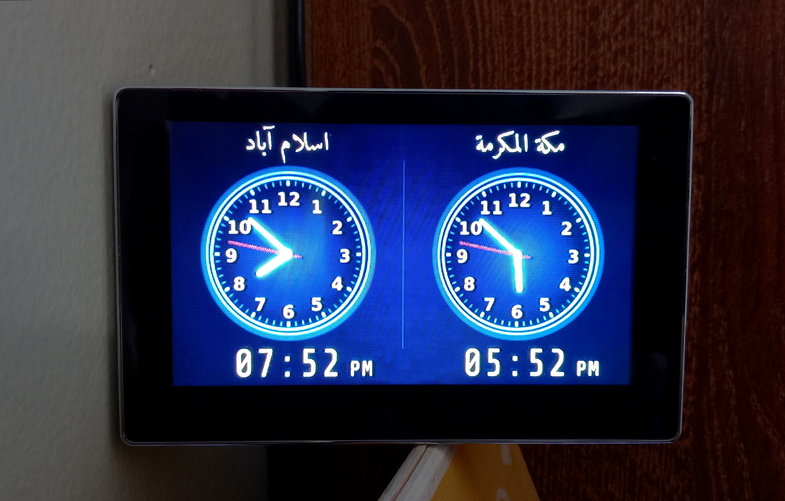

# World Clock
Dual-timezone world clock for Raspberry Pi and a portable car reverse camera monitor.




## About

This project runs a simple clock display on a Raspberry Pi 2 connected to a 4.3-inch RCA car monitor. The application is written in C++ with a Qt 5 frontend and renders directly to the Linux framebuffer. No X11 or Wayland server required.

The dashboard starts automatically on boot via systemd and runs in full-screen mode. You can configure which timezones to display and what to call them by editing the configuration file at `/etc/world-clock/clock.conf`.

## Installation

### Prepare the OS

Download the Raspberry Pi Imager and flash an SD card with Raspberry Pi OS Lite (make sure to use the variant without a desktop). Configure WiFi, username, and password during setup. Don't forget to enable SSH while you are at it.

### Download and Build

Log into your Pi via SSH and run these commands (assuming your username is **pi**):

```bash
# Create directory
sudo mkdir -p /opt/world-clock
sudo chown pi:pi /opt/world-clock
cd /opt/world-clock

# Download and unzip the source code
wget https://github.com/fauky/world-clock/archive/refs/heads/main.zip -O world-clock.zip
unzip -j world-clock.zip
rm world-clock.zip

# Build and install
chmod +x build.sh
sudo ./build.sh
```

The build script handles everything automatically. It modifies the Raspberry Pi config for RCA video output, installs Qt and other dependencies, compiles the binary, creates a configuration file at `/etc/world-clock/clock.conf`, and sets up a systemd service to run the clock on boot. The script also prompts to configure cron jobs for screen blanking at the end if you want it.

## Configuration

Edit the clock configuration file to change timezones and location names:

```bash
sudo nano /etc/world-clock/clock.conf
```

After making changes, restart the service to apply them:

```bash
sudo systemctl restart world-clock
```

I am displaying the location names in Arabic, but you can write in any language as long as there is a font installed for it. The fonts for displaying location and digital clock are defined in `src/ClockFace.qml`. Search for **Amiri** and **Share Tech Mono** in `src/ClockFace.qml` to find the relevant lines of code. Take a look at the sample config file in `config/clock.conf` in this repo for a sample.


## Screen Blanking for Burn-in Protection

If you want to protect against screen burn-in on a continuous display, the installer can set up cron jobs to manage the display during off-hours.

Since you can't completely disable the analog video signal on the Pi (I know, I can't, but if you know, please let me know too), the script works around this by stopping the clock service and blanking the framebuffer at night. This makes the screen go completely black (though the backlight stays on). In the morning, it re-enables the framebuffer and restarts the clock service. The ON and OFF times can be configured by editing the script `build.sh`. Search for **CRON_ON** and **CRON_OFF** and you will find the lines. The scripts are located in the scripts directory.

## Read-Only Filesystem

Since this Pi is running in completely headless mode, it is not possible to gracefully shut it down without loggin in to it via SSH, i would recommend you to enable overlayfs to prevent SD card corruption. This makes the filesystem read-only and hopefully it can survive sudden power loss.

Run the Pi configuration tool:

```bash
sudo raspi-config
```

Go to **Performance Options**, select **Overlay File System**, and make both root and boot partitions readonly when prompted. Reboot when done.

## Fonts

The project uses two custom fonts:

- **Hosni Amiri:** For location names, especially those with Arabic text like Islamabad or Makkah.
- **ShareTechMono:** A monospaced font for the digital time display at the bottom of the screen.

The first font is available in Debian repositories and is installed using `apt`, but the second one is downloaded using wget from Google's fonts repository <https://github.com/google/fonts>

---

*Developed with partial assistance from AI tools to generate portions of the C++ and QML code.*
